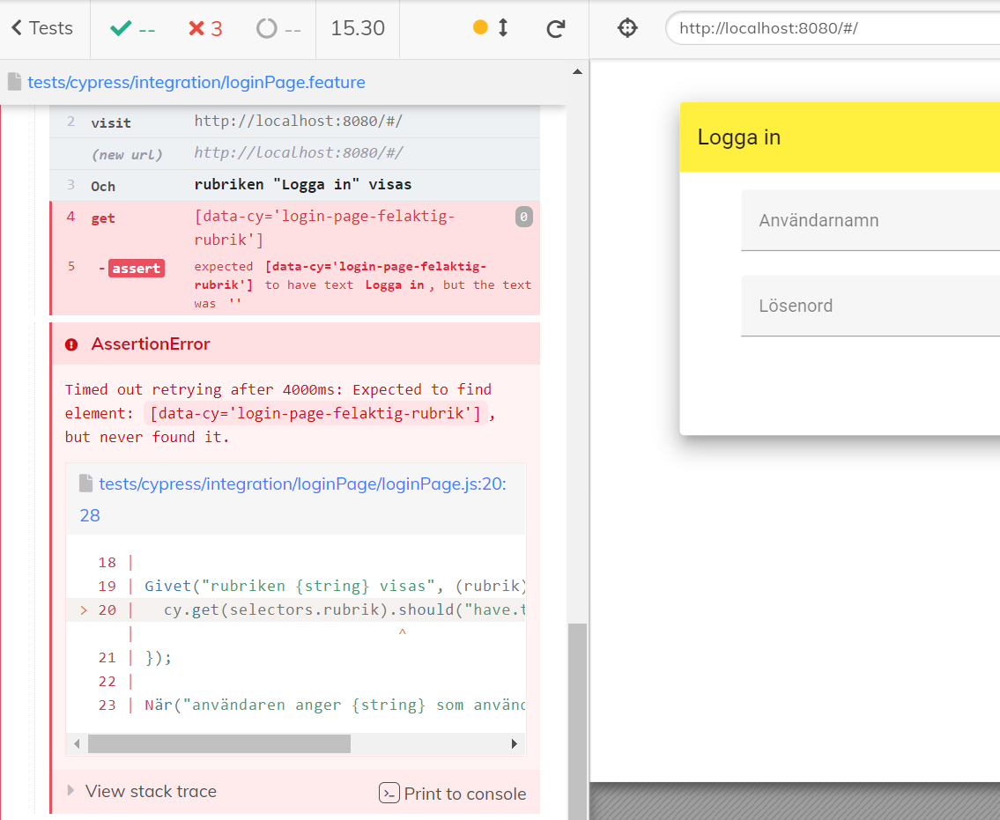

# cypress-demo

## Inledning

En aningen slafsig men till sitt syfte väl fungerande demonstration över hur man med enkla medel kan skapa transparens och delaktighet i sin testprocess.

Förvisso ingen ovanlig approach, men det kan utnyttjas mycket mer i webbapplikationer än vad det tycks göra idag.

**Demoprojektet bygger på följande tekniker:**

* **Vuejs** (JS-ramverk)
* **Cypress** (E2E Frontend Testing Framework)
* **Cucumberjs** (Gherkin SBE)

## Scenarion
<em>Testscenarion som används som grund för testerna i detta projekt.</em>

**Scenario**: Inloggningen går inte att genomföra när användarnamnet är för långt 
**Givet** att sidan har öppnats 
**Och** rubriken "Logga in" visas 
**När** användaren anger "august.wande" som användarnamn 
**Och** användaren anger "rättlösen" som lösenord 
**Så** är knappen Logga in inaktiverad  

**Scenario**: Inloggningen går inte att genomföra när lösenordet är felaktigt 
**Givet** att sidan har öppnats 
**Och** rubriken "Logga in" visas 
**När** användaren anger "augustw" som användarnamn 
**Och** användaren anger "fellösen" som lösenord 
**Så** är knappen Logga in inaktiverad 

**Scenario**: Användaren loggas in och dirigeras till startsidan 
**Givet** att sidan har öppnats 
**Och** rubriken "Logga in" visas 
**När** användaren anger "augustw" som användarnamn 
**Och** användaren anger "rättlösen" som lösenord 
**Och** användaren trycker på logga in 
**Så** dirigeras användaren till startsidan 

**Scenario**: Användaren ändrar inställningar och kontrollerar ändringarna i översikten 
**Givet** att användaren är inloggad 
**Och** rubriken "cypress-demo" visas 
**När** användaren anger färgen "#444444" som färg för "body" 
**Och** användaren anger färgen "#99FF99" som färg för "main" 
**Och** användaren anger rubriken "Hello //Cypress" 
**Och** användaren navigerar till "Översikt" 
**Så** färgprovet för "body" har färgen "#444444" 
**Och** färgprovet för "main" har färgen "#99ff99" 
**Och** rubriken "Hello //Cypress" visas
</code>

## Live-exempel på ovanstående scenarion

# Cypress

<ul>
    <li>Tillhandahåller GUI som kan användas lokalt vid tets. Går även att köra via cmd.</li>
    <li>Cypress ger otroligt tydliga loggar vilket underlättar felsökning även för den obevandrade testkodaren. Se illustration nedan.</li>
    <li>Möjlighet till screenshots och videos för att visualisera fel som en del i felsökning och testrapportering.</li>
    <li>Kan användas i CI-pipelines</li>
    <li>Testrapporter går att få i ex. formaten junit, json, html</li>
    <ul>
        <li>Finns även ett onlineverktyg för att hålla koll på dina testrapporter (Cypress Dashboard)</li>
    </ul>
</ul>

**Felutskrifter i Cypress-GUIt**
